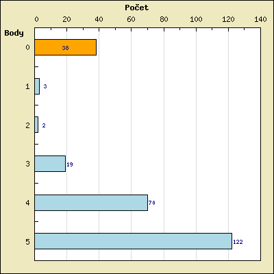
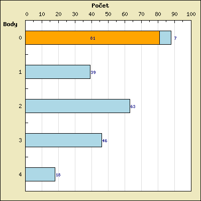
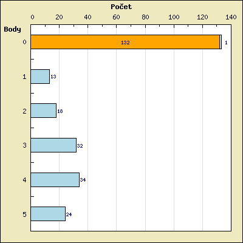

# TIN-domaci-ukoly
Domácí úkoly z předmětu TIN - FIT VUT 2019/2020

Body:
* 1. Úkol 5/5
* 2. Úkol 2.7/5 !
* 3. Úkol 5/5

Druhý úkol přidávám spíše na inspiraci jak se to nemá dělat. V našem ročníku z něj nikdo neměl plný počet, průměr byl někdo okolo dvou bodů. 

Třetí úkol se nepočítal do zápočtu, proto jej hodně lidí neodevzdalo, nebo jen s některými příklady vypočítanými na minimum u zkoušky. Jinak byl výrazně jednodušší než druhý.
### 1. úkol

### 2. úkol

### 3. úkol

